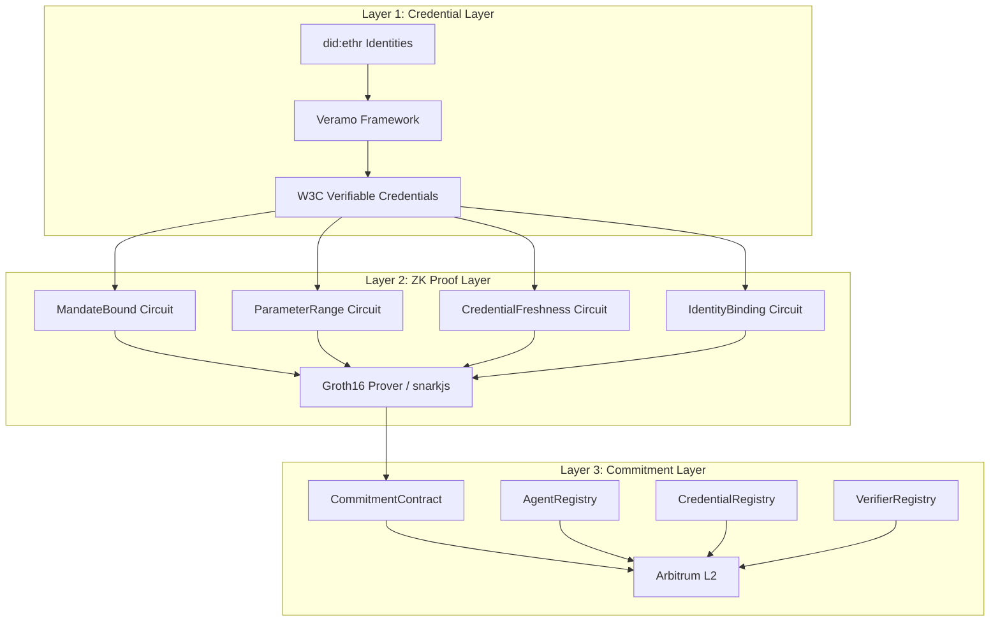
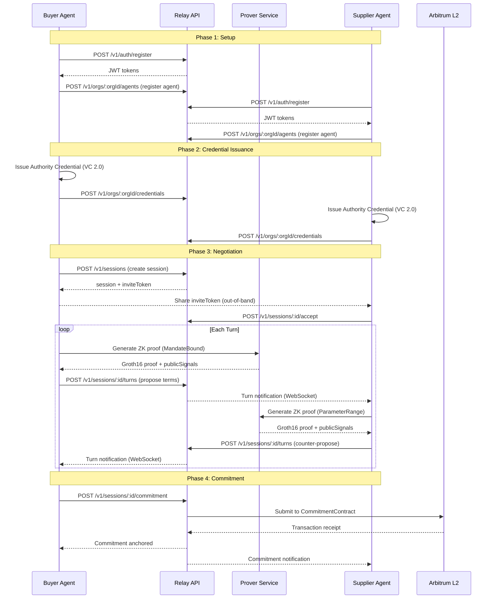
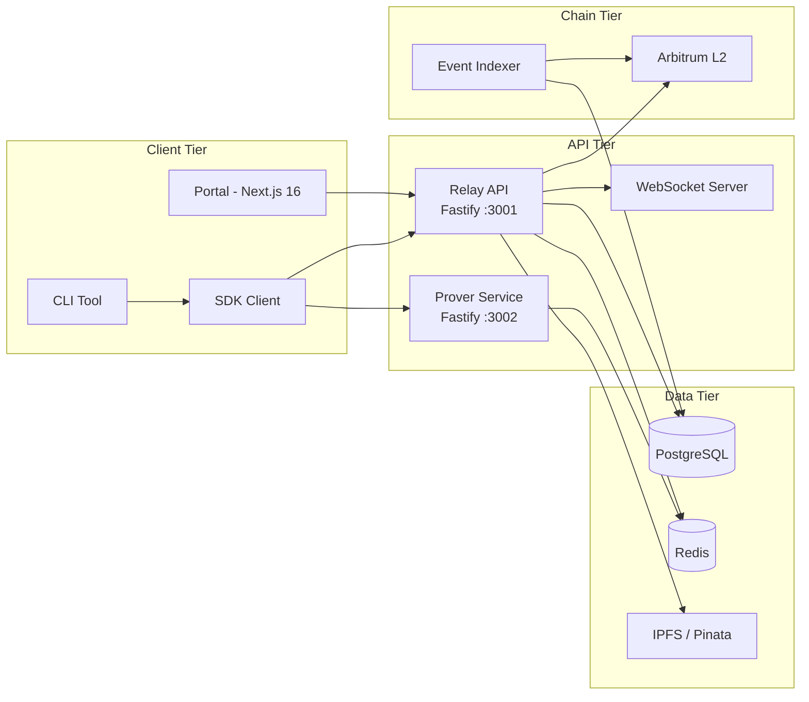
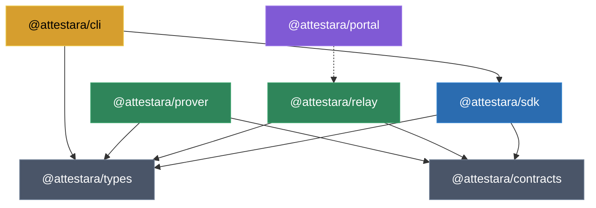
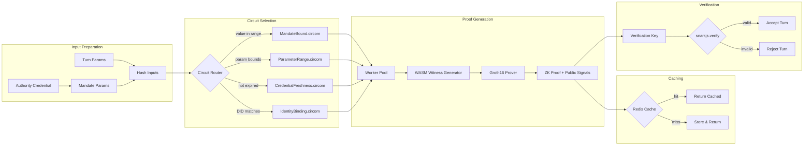
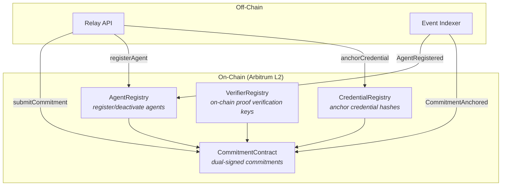
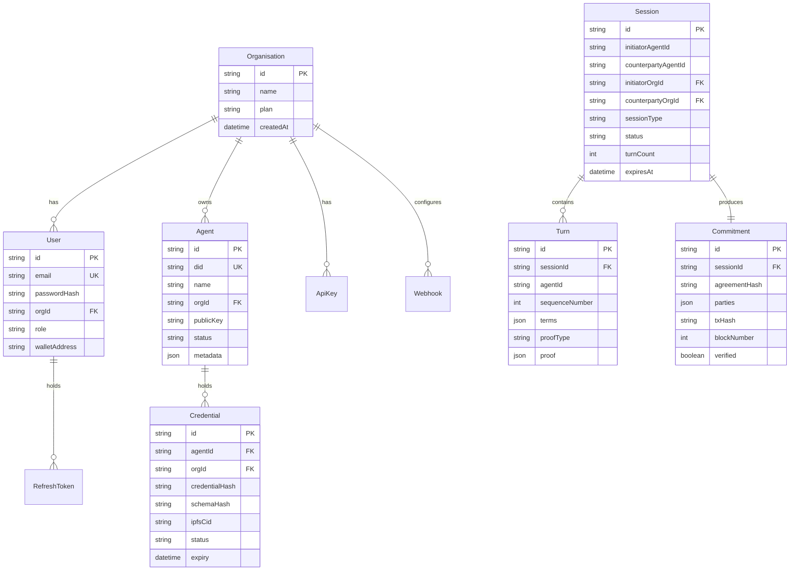
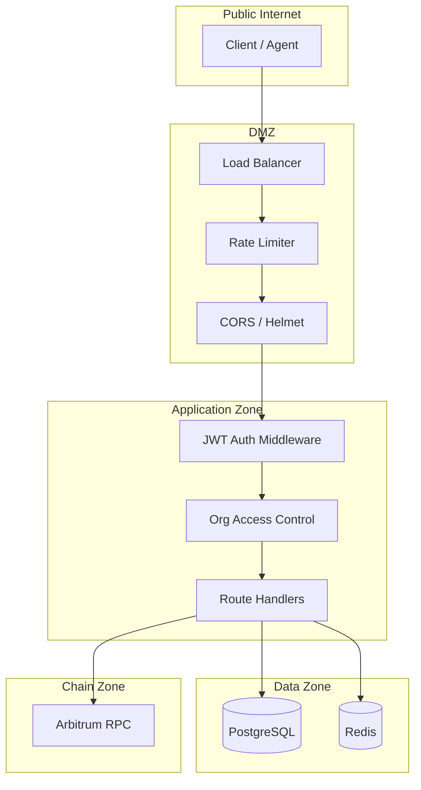

# Attestara Architecture

This document describes the system architecture of the Attestara cryptographic trust protocol. All diagrams use Mermaid syntax for inline rendering on GitHub and compatible platforms.

---

## Protocol Overview

Attestara implements a three-layer trust protocol for autonomous AI agent commerce:

## Negotiation Sequence

The following diagram shows the full lifecycle of a negotiation between two agents:

## Deployment Topology

## Package Dependency Graph

## Proof Generation Data Flow

## Smart Contract Architecture

## Data Model (Relay)

## Security Boundaries

