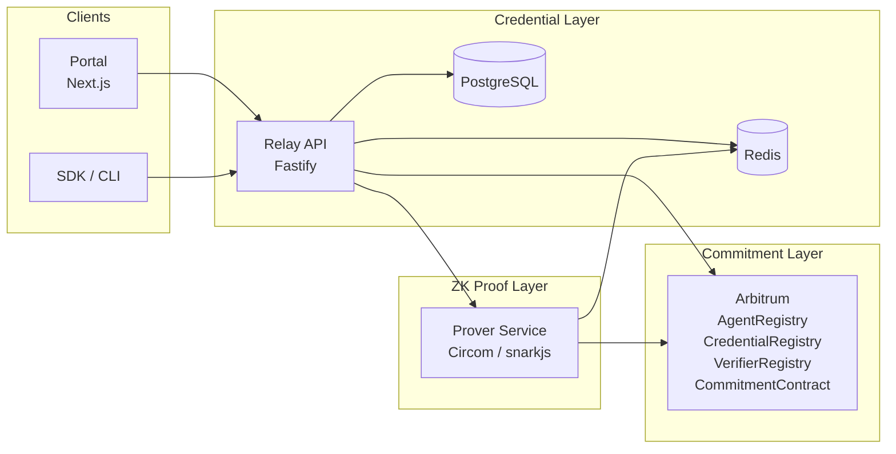

# Attestara Audit Preparation Dossier

This document is intended for external security auditors reviewing the
Attestara protocol, smart contracts, and supporting services. It summarizes
the system, trust boundaries, assets, adversary model, invariants, residual
risks, and how to get a working environment.

For the disclosure process and scope boundaries, see
[`SECURITY.md`](../SECURITY.md) at the repository root.

## 1. System Overview

Attestara is a three-layer zero-knowledge trust protocol for autonomous
agents. Credentials are issued and stored off-chain; proofs are generated by
a dedicated prover service; commitments are anchored on Arbitrum.



Pinata / IPFS is used for public artifact storage (e.g. verifier metadata,
credential schemas) and is addressed by content hash verified at the Relay.

## 2. Trust Boundaries

| Surface           | Trusts                                             | Verifies                                                    |
| ----------------- | -------------------------------------------------- | ----------------------------------------------------------- |
| Portal (browser)  | Session cookies only                               | CSRF token on state-changing requests                       |
| Relay API         | JWT, API keys, SIWE signatures                     | Signature validity, per-principal rate limits, input schemas |
| Prover Service    | Internal secret issued by the Relay                | HMAC on every request, replay window                         |
| PostgreSQL        | Relay connections only                             | TLS, rotating DB credentials                                 |
| Redis             | Relay and Prover only                              | TLS optional (recommended in prod), ACL / password           |
| Smart Contracts   | Verifier registry entries, caller address          | ZK proofs, admin mapping, ECDSA signatures (EIP-712)         |
| IPFS / Pinata     | Public read                                        | Content hash verified by Relay before use                    |

## 3. Assets

In rough order of blast radius:

1. **Agent private keys** — held by agent operators; used to sign session
   commitments.
2. **Credential signing keys** — held by issuers; used to sign credential
   assertions.
3. **Session negotiation terms** — pre-commitment data whose privacy is
   protected by the ZK layer.
4. **On-chain commitment signatures** — dual-signed EIP-712 payloads.
5. **Org membership data** — who belongs to which organization; stored in
   PostgreSQL.
6. **`JWT_SIGNING_SECRET`** — authenticates Relay-issued sessions.
7. **`PROVER_INTERNAL_SECRET`** — HMAC key between Relay and Prover.
8. **`ORG_MASTER_KEY_SECRET`** — encrypts per-org secrets at rest.
9. **Pinata API credentials** — ability to pin / unpin IPFS content.
10. **`DEPLOYER_PRIVATE_KEY`** — controls contract admin operations. Must be
    rotated externally (hardware wallet / KMS); never committed to the repo.

## 4. Adversary Model

### External Attacker (Internet)
Unauthenticated remote attacker. Goals: take over an account, forge a
commitment, trigger DoS, exfiltrate org data. Capabilities: send arbitrary
HTTP/WS, read public chain state, submit transactions.

### Malicious Org Member
Holds a valid account inside a target org. Goals: escalate to admin, exfil
other orgs' data, forge commitments on behalf of other members.

### Compromised Agent
Legitimate agent whose private key has been stolen. Goals: sign bogus
commitments until the agent is deregistered.

### Malicious Verifier Contract
A verifier contract registered in `VerifierRegistry` that behaves adversarially
during proof verification (reentry attempts, gas griefing, lying return
values). Goals: drain ETH from `CommitmentContract`, corrupt state.

### Network Observer (on-path, passive)
Can read traffic between client, Relay, Prover, and the chain RPC. Goals:
learn session terms, link agents to orgs, replay requests.

## 5. Solidity Invariants

Each invariant is phrased as a testable property. Fuzzing targets should
encode these directly.

### AgentRegistry
1. Only addresses that pass `isRegisteredAdmin(caller)` may register or
   deregister agents.
2. Every registered agent's DID is globally unique; double-registration MUST
   revert.
3. An agent can only be deregistered by the admin that registered it.
4. Every state change (register, deregister, admin update) MUST emit an
   event.

### CredentialRegistry
1. Credential hashes are unique; duplicate issuance MUST revert.
2. Revocation is monotonic: once `revoked == true`, it cannot be set back to
   `false`.
3. Only the original issuer or a registered admin may call `revoke`.

### VerifierRegistry
1. Only registered admins may register a verifier circuit.
2. Circuit IDs are unique; re-registration MUST revert.
3. The verifier contract address for a given circuit ID is immutable after
   registration (no upgrade path in-contract).

### CommitmentContract
1. Only the two commitment parties, or a registered relay address, may call
   `anchorSession`.
2. `createCommitment` requires **both** party signatures to be valid; a
   single-party call MUST revert.
3. `ReentrancyGuard` MUST prevent external verifier contracts from reentering
   commitment state.
4. Commitment IDs are globally unique across all sessions.
5. The dual-signature check uses ECDSA recovery against an EIP-712 domain
   separator that binds `chainId`, `verifyingContract`, and contract version.

## 6. Known Residual Risks & Mitigations

| Risk                                              | Status / Mitigation                                                                 |
| ------------------------------------------------- | ------------------------------------------------------------------------------------ |
| Single-instance WebSocket scale                   | Planned: Redis pub/sub fan-out across Relay instances.                               |
| IPFS pinning depends on Pinata availability       | Fallback: in-memory pinning in Relay; data loss on restart is accepted pre-1.0.      |
| Oracle clock drift for session expiry             | Relay clamps expiry windows; on-chain expiry uses `block.timestamp` with wide bound. |
| Arbitrum sequencer censorship                     | Inherited from L2; force-inclusion via L1 bridge documented for operators.           |

## 7. Auditor Onboarding

From a clean clone of the repo:

```
pnpm install
cp .env.example .env  # fill in values
docker-compose -f infrastructure/docker-compose.yml up -d postgres redis
cd packages/relay && pnpm db:generate && pnpm db:migrate && cd ../..
pnpm build
pnpm test
pnpm test:integration
cd packages/contracts && npx hardhat test
```

### Recommended Tools

- **Slither** — `pip install slither-analyzer`; run against
  `packages/contracts`.
- **Mythril** — symbolic analysis of individual contracts.
- **Echidna** — property-based fuzzing; encode the invariants from section 5.
- **Manticore** — symbolic execution for deeper path coverage.
- **Semgrep** — TypeScript rules for the Relay, Portal, SDK, and CLI.

Please report findings via the channel described in
[`SECURITY.md`](../SECURITY.md).

## 8. Contact & Scope Boundaries

- Email: **security@attestara.ai**
- Scope (in and out) matches [`SECURITY.md`](../SECURITY.md) exactly; this
  dossier does not expand scope.
- Questions about environment setup or invariant interpretation can be sent
  to the same address and will be routed to the engineering team.
